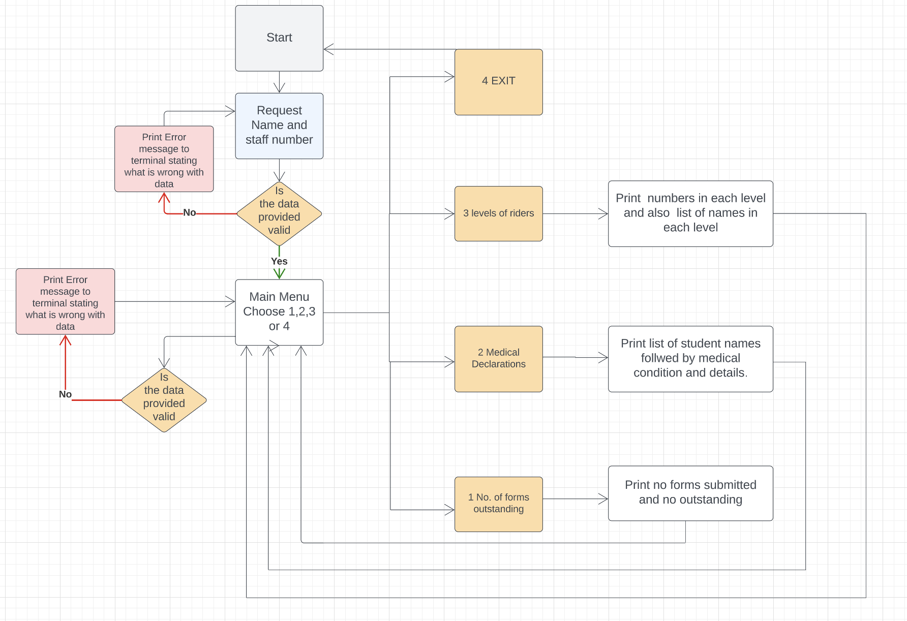
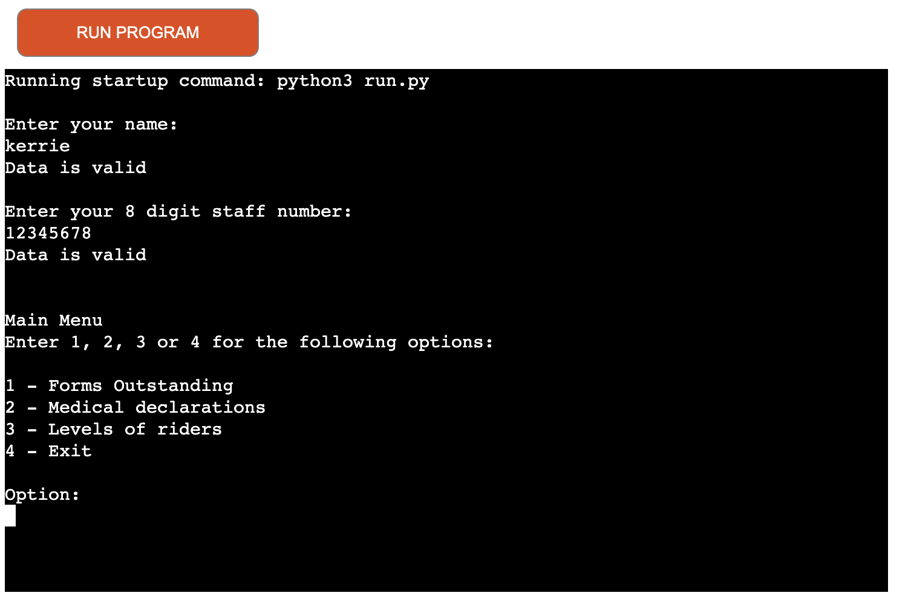
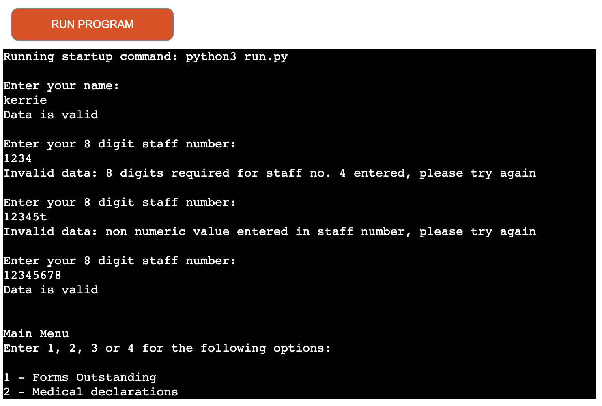
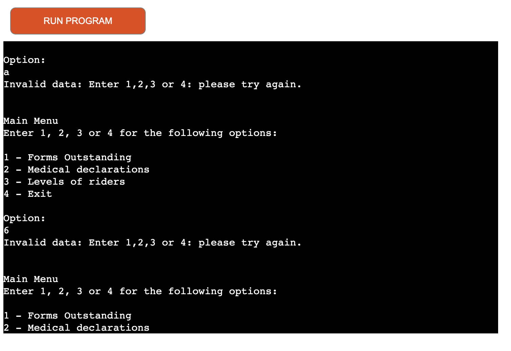
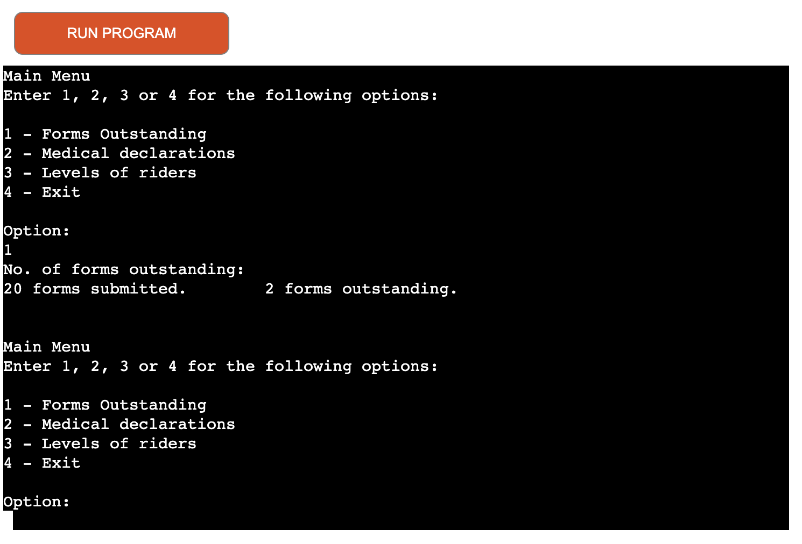
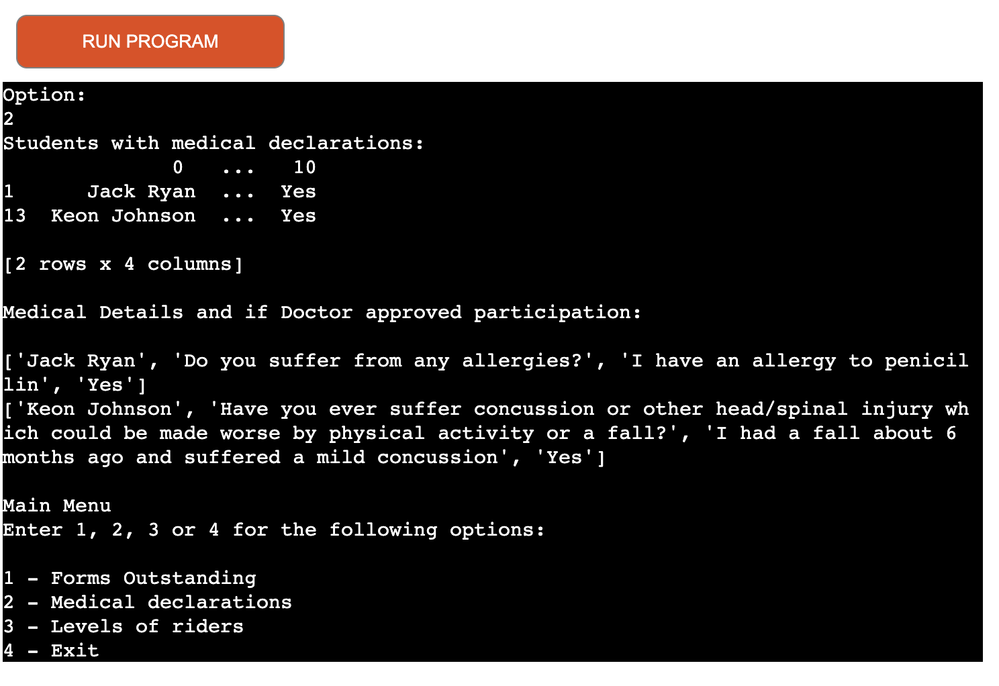
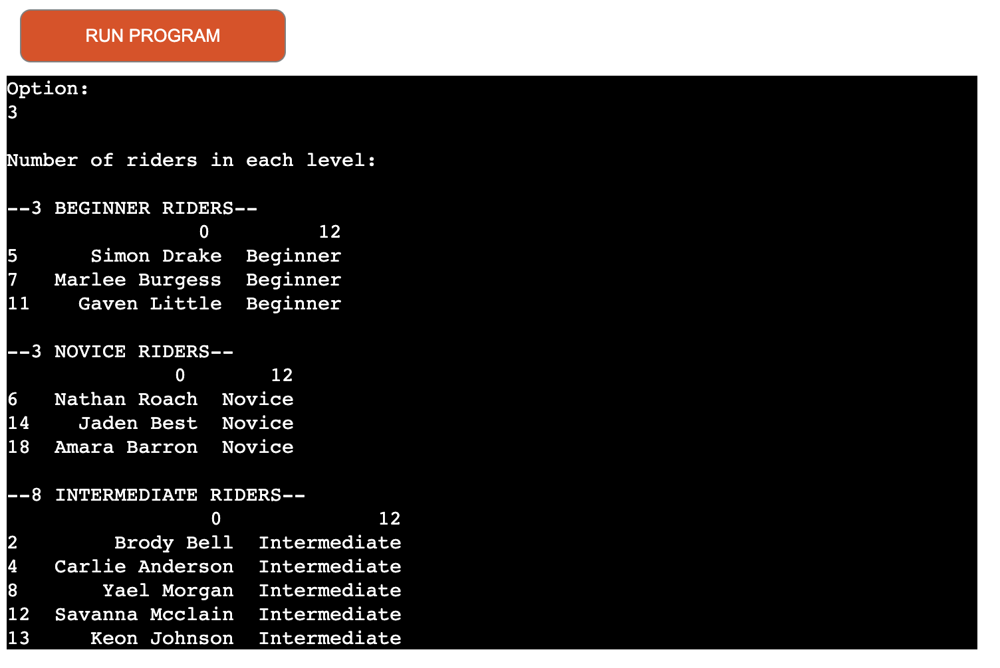
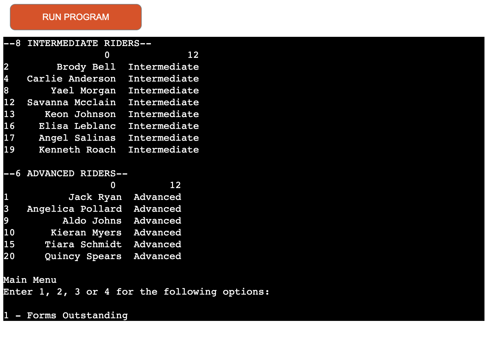
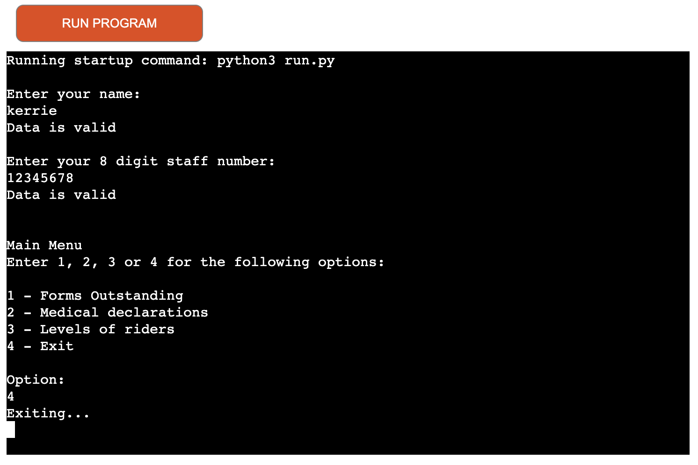

# Portfolio Project 3 Kerrie Jones
This application gleans information from a dataset in an easy and convenient manner.
The Google Sheets dataset is created from Google Forms data. These forms are filled out by students before they begin their practical element of a horsemanship course. Information such as name, contact, emergency contact, any medical declarations, and level of experience is included on the form. 
The teachers on the course can use this application to find relevant and specific information more conveniently than manually searching through all the forms.
[Link to deployed site at heroku pages here](https://pp3-kerrie-jones.herokuapp.com/)
* Flowchart \
Flowchart was created in lucidchart to plan and then implement project

# How to Use
User enters name and staff number. Main menu will appear with 4 options. Number of forms outstanding, Names and details with medical declarations, Levels of riders and Exit. User chooses what information they need and application will return requested information.

## User Experience
### External User: 
The application user wants to glean specific insights from student intake forms quickly and conveniently without having to search through all the forms manually.
### Site owner:  
The application should provide useful insights from a dataset created from Google forms

# Features
## Existing Features
 

### Enter Name
Application requests name. ValueError raised if input is not letters.
 

### Enter Staff Number
Application requests staff number. ValueError raised if number length is not 8 or if inputted values are not numerical.
 

### Main Menu
Main menu requests the user selects 1 of 4 options shown below. While loop will request information from user until valid input received. If numbers 1,2,3 or 4 are not inputted a vaueEror will be raised.
 

### 1 Forms Outstanding
The amount of forms submitted and forms outstanding is printed in the terminal for the user. Counts rows of data in forms_data and subtracts 1 so heading are not counted.
 

### 2 Medical Declarations
This option checks which students have medical declaration and prints their names to the terminal. After this a list with the details of declaration for each student is also printed to the terminal along with if their doctor has approved them to participate in equestrian activities.
 

### 3 Level of Riders
Columns with student name and level only are printed to the terminal grouped by level: beginner, novice, intermediate and advanced. 

### 4 Exit
Exits main menu

## Future Features

# Data Model

# Testing
This project has been manually tested by:
* passing code through a PEP8 linter and ensuring there are no signifigant errors
* Checked validation by entering number where letters should be and vice versa and tried entering incorrect staff number length
* tested both in local and heroku terminal

## Validator Testing
* PEP8 
## Bugs
### Solved Bugs
* when name and staff number were validated if there was an error both needed to be inputted again. Corrected this by separating validation forboth inputs.
* After each information option was chosen user needed to enter name and staff number again returned user to main menu function after each optional function instead to correct.
*
*
### Remaining Bugs
* No remaining bugs found

# Deployment
* Code Institute's mock terminal for Heroku was used to deploy this project
## Steps for Deployment
* Fork or clone this repository
* Create a new Heroku app in heroku dashboard
* Add config Vars for creds
* Set buildbacks to Python and NodeJS in that order 
* Link Heroku app to the repository
* Click on Deploy

# Technologies Used
## Languages Used
* Python
## Frameworks, Libraries and Programmes Used
* Heroku - Deployment platform
* GIT - used for version control
* GITHub - code pushed from GIT and stored in GITHub
* GITPod - workspace used in gitpod to work on project then push to github
* Lucid - Flowchart editor
* Google Sheets
* Google Cloud
* Google Drive
* Google Forms
* Python Libraries: gspread, google-auth.Credentials and pandas

# Credits
* code institue for the deployment terminal
* love-sandwiches walkthrough for code for setting up google sheets

## Content
* all content in forms is fictional and not taken from real individuals
